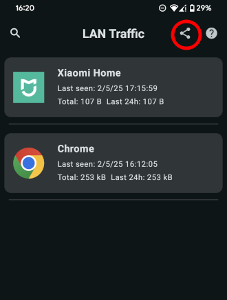
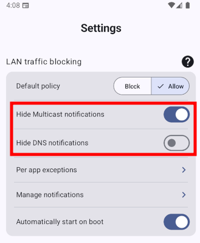
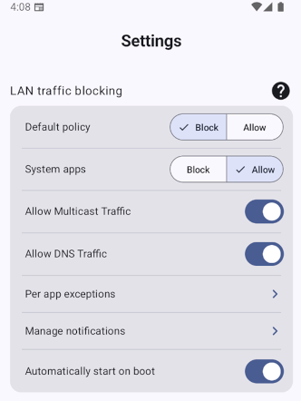

# LANShield

This repository contains the source code of the LANShield Android app. You can visit the project's website at [lanshield.eu](https://lanshield.eu/) and download the app from the following sources:

* [Google Play Store](https://play.google.com/store/apps/details?id=org.distrinet.lanshield)

* [F-Droid](https://f-droid.org/en/packages/org.distrinet.lanshield/)

* [Direct APK download](https://gitlab.kuleuven.be/distrinet/research/netsec/lanshield/-/releases)

## Features

A summary for a general audience of the features of LANShield is available on the [lanshield.eu](https://lanshield.eu/) website. This README will also cover more detailed features.

### Controlling LAN access

LANShield allows users to control which apps are (dis)allowed to access the LAN. It has a global setting on blocking or allowing all LAN traffic by default. This setting further differentiates between system and non-system apps, i.e., a user can allow all system apps to access the LAN by default but block all non-system apps from doing so. The user can override this global setting for specific apps. For example, a user might want to block all access to the LAN except for app A. In this case, the user would set the default policy to block LAN access and the app A's explicit policy to allow access.

### Export LAN access history

When LANShield detect LAN traffic, it saves relevant data to enable later analyses of LAN access behaviour.
In particular, LANShield assigns intercepted packets to _flows_ where a _flow_ is a TCP or UDP connection or session, respectively, meaning many packets may belong to a specific flow. We then log which app initiated this flow, as well as how long this flow lasted, the source and destination IPs, the source and destination ports, and the amount of data and packets transmitted (both ingress and egress). These flows are available to the user, as shown below, and they **can also export all flows to a JSON file by clicking on the shared button (encircled in red below)**.

This export functionality is implemented by the function `ExportFile` in [`Common.kt`](app/src/main/java/org/distrinet/lanshield/ui/components/Common.kt).

### Fine-grained access control

To have more fine-grained access on which traffic is allowed or results in a nofication, you can also separately control DNS and Multicast traffic. This is useful because this traffic occurs a lot, and often it can be useful to allow this traffic by default, while still blocking or receiving notifications for other traffic.

This feature was finalized in commits [`5dc7fb7f`](5dc7fb7f) and [`70b1dfaf`](70b1dfaf).

### Linux Support

The LANShield app is specific to Android. If you also want to control LAN access on Linux, then we recommend [OpenSnitch](https://github.com/evilsocket/opensnitch). We [conributed code](https://github.com/evilsocket/opensnitch/pull/1237) to OpenSnitch to make it easier to specifically control LAN access.

# Acknowledgements

LANShield is an academic research project from the [DistriNet](https://distrinet.cs.kuleuven.be/) Research Group at KU Leuven (Belgium) that aims to enhance the security of local network (LAN) access by mobile apps. This research is supported by the Research Fund KU Leuven, the Flemish Research Programme Cybersecurity, and Google's 2023 Android Security and PrIvacy REsearch (ASPIRE) Award. The open-source development and maintenance of LANShield is sponsored by [NLNet](https://nlnet.nl/project/LocalShield/).
