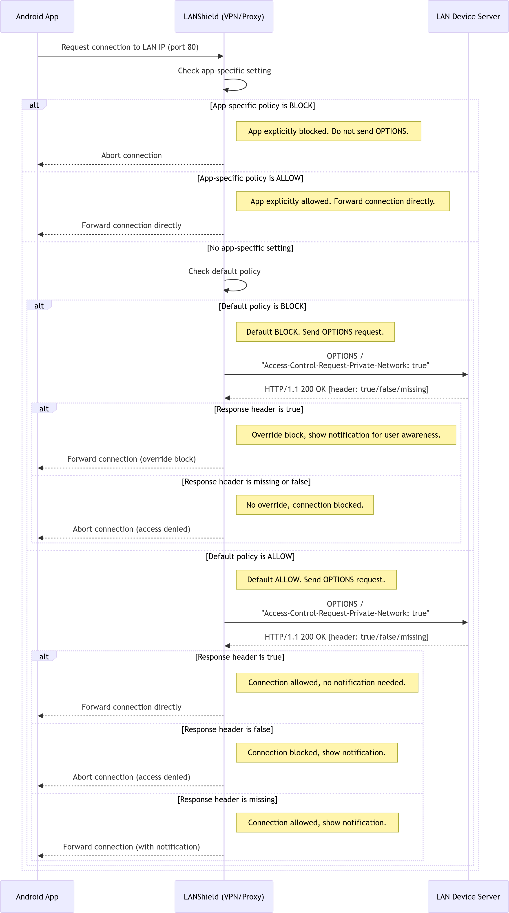
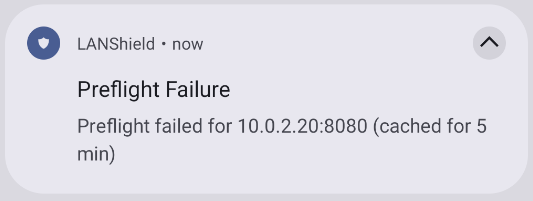

# LANShield with Access Protocol

This branch implements a Proof-of-Concept protocol to enable seamless LAN access for mobile apps. Our access protocol is based on the [Private Network Access (PNA)](https://wicg.github.io/private-network-access/) specification for browsers.

The idea is to ensure that before any local HTTP request is allowed, the app first sends a preflight OPTIONS request to verify whether the destination can be safely accessed by any mobile app. In particular, this OPTIONS request contains the header `Access-Control-Request-Private-Network`. Simplified, the connection is automatically allowed only if the destination responds with the header `Access-Control-Allow-Private-Network: true`. If `Access-Control-Allow-Private-Network: false` is sent back, the connection is blocked. The precise influence of this header is described below.

Note that the LAN device is expected to only show sensitive information after an additional layer of authentication. For instance, a router implementing the access protocol can show basic information to any app, such as whether there is an active Internet connection, but should only give detailed network information or admin access after extra authentication, e.g., only after the user supplies a correct router password.

## Assumptions

Our access protocol, as described in this document and as implement in LANShield, assumes that both the mobile OS and the LAN devices are trustworthy and have not been compromised. If either of them is compromised or exploitable, then an attacker can abuse or exploit either of them to access and attack the LAN. This is summarized in the following table:

|                            | Mobile OS Trusted         | Mobile OS Exploitable  |
| -------------------------- | ------------------------- | ---------------------- |
| **LAN Device Trusted**     | Access Protocol is secure | No security guarantees |
| **LAN Device Exploitable** | Security guarantees vary  | No security guarantees |

A special case is when the Android device is trusted, but the LAN device has a vulnerability that can only be exploited by a malicious insider. In that case, the resulting security guarantees of our access protocol depend under which conditions the LAN device can be exploited. If the LAN device can only be exploited on a non-HTTP port, or only after an additional layer of authentication, then the access protocol is secure, in the sense that it does not reduce security guarantees compared to the standard LANShield app. However, if the app can be exploited on an HTTP port on which the LAN devices ha implemented the access protocol, then a malicious Android app can exploit the LAN device while this would have required user approval with the standard LANShield app. 

Overall, this implies that LAN devices should only enable the proposed access protocol on endpoints that are sufficiently secure. Additionally, these endpoints should not show private information without implementing a secondary layer of authentication. For instance, a router implementing the access protocol can show basic information to any app, but should only give detailed information or admin access after extra authentication.

## Access Protocol Diagram

The precise specification of our access protocol is shown in the diagram below. This is based on the following principles:

- If the user explicitly configured LANShield to allow or block a given app from accessing the LAN, then this setting is always honored, meaning no preflight request is sent.

- If the default policy is block, and there are no app-specific settings, then the access protocol can automatically allow LAN access, but a notification will still always be shown to the user.

- If the default policy is block, and there are no app-specific settings, then the access protocol can suppress the notification that is otherwise shown by default.

The results in the following specification:

## Implementation notes

- The preflight requests are done in plaintext HTTP.

- **PnaManager Class:** A new class, PnaManager, sends preflight OPTIONS requests using `HttpURLConnection`. It sets the header `Access-Control-Request-Private-Network: true` and checks that the response code is 200 and that the response includes `Access-Control-Allow-Private-Network` set to "true".
  
- **Caching:** The results of the preflight request are cached by `PnaCacheManager` for 5 minutes (for both allowed and denied outcomes) to prevent sending duplicate preflight requests for the same IP:port combination.

- **Standard Notifications:** When a packet is forwarded (for example, when the effective global policy is ALLOW), a standard notification is shown using the existing mechanism. This notification also takes into account multicast and DNS filtering.

- **Preflight Failure Notifications:** If a preflight check fails, a preflight failure notification is posted:

	- **Keyed Notifications:** For each destination (keyed by ip:port), only one notification is shown within the 5‑minute cache period.

	- **Timer-Based Removal:** After the 5‑minute timeout, the key is removed from the active notification map so that a new notification can be posted if the preflight check fails again.

## Testing the Access Protocol

For testing, a controlled environment was set up to simulate local servers. In particular, the script [server_pna_poc.py](access-protocol/server_pna_poc.py) can be used to set up two HTTP servers: one server that does not support our access protocol, on port 8081, and a second server on port 8080 that parses and respond to the `Access-Control-Request-Private-Network` header.

**Test Setup:**
Two local test servers were configured to simulate destinations:
- **Server with Access Protocol Support:**
  Responds to OPTIONS requests with Access-Control-Allow-Private-Network: true.
- **Server without Access Protocol Support:**
  Responds without the PNA header.

**Test Observations:**
- Preflight requests are sent to the server’s IP and port.
- When the server supports PNA (i.e., returns the header), the preflight succeeds and the connection is allowed without additional notifications.
- When the server does not support PNA, a preflight failure notification is posted. The caching mechanism ensures that only one notification is shown per IP:port until the 5‑minute timeout expires.
  
  

This POC demonstrates that the PNA protocol can be implemented gradually—allowing a step-by-step rollout across devices and servers—while ensuring that the system continues to function smoothly throughout the process.

## Future Work

- Our current proof-of-concept implementation does not consider the exact page being accessed using HTTP. A more fine-grained implementation would consider the exact page being accessed, and would send a preflight request specifically for the page being accessed.

- Another possible defense, that would not rely on cooperation from the LAN devices, is for the mobile OS to show a device picker to let the user control which LAN devices an app is allowed to interact with. Although this defense would require user interaction, a similar dialogue is already used in normal circumstances, e.g., when selecting with printer or screen to connect with.

